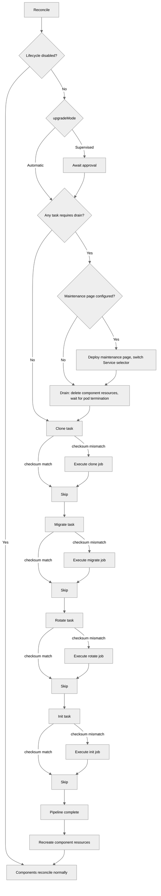

<!--
Licensed to the Apache Software Foundation (ASF) under one
or more contributor license agreements.  See the NOTICE file
distributed with this work for additional information
regarding copyright ownership.  The ASF licenses this file
to you under the Apache License, Version 2.0 (the
"License"); you may not use this file except in compliance
with the License.  You may obtain a copy of the License at

  http://www.apache.org/licenses/LICENSE-2.0

Unless required by applicable law or agreed to in writing,
software distributed under the License is distributed on an
"AS IS" BASIS, WITHOUT WARRANTIES OR CONDITIONS OF ANY
KIND, either express or implied.  See the License for the
specific language governing permissions and limitations
under the License.
-->

# Lifecycle

The operator manages database migrations and application initialization through
dedicated lifecycle tasks. This page covers configuration, behavior, and
troubleshooting.

## Overview

The `spec.lifecycle` section controls up to four sequential tasks:

1. **clone** — database snapshot from an external source (staging workflows)
2. **migrate** — `superset db upgrade` (database schema migration)
3. **rotate** — `superset re-encrypt-secrets` (secret key rotation)
4. **init** — `superset init` (application initialization: roles, permissions)

Tasks run as parent-owned Jobs. The parent
Superset controller orchestrates sequencing, gating, re-runs, Job lifecycle,
retries, and timeouts, and stores durable task state in
`status.lifecycle`.

Lifecycle is enabled by default even when `spec.lifecycle` is nil; disable it
explicitly with `spec.lifecycle.disabled: true`.

**Key behaviors:**

- Clone must complete before migrate starts; migrate before rotate; rotate before init
- Components are not created or updated until all enabled tasks complete
- When config or image changes require a re-run, the parent deletes the old task Job and creates a fresh one

## Task Triggers

Each task has hardcoded trigger inputs — what it watches for changes:

| Task | Watches | Re-runs when... |
|------|---------|-----------------|
| Clone | `trigger` field, `cronSchedule` tick, source config, excludes, target Superset image | Trigger value changes, schedule tick boundary crossed, source DB config changes, or target image changes (so a downgrade triggers a fresh clone before migrate sees the older schema) |
| Migrate | Image (resolved lifecycle image), `metastore.createDatabase` flag | Image tag or repository changes, or `createDatabase` is toggled |
| Rotate | `trigger` field, `secretKeyFrom` ref, `previousSecretKeyFrom` ref | Secret key references change or trigger value changes |
| Init | Config checksum (rendered Python config) | Any config-affecting field changes |

All tasks also re-run when an upstream task re-executes (automatic propagation).

### Manual Trigger

Every task has a `trigger` field (on `BaseTaskSpec`) — an opaque string that
forces a re-run when changed. Changing a trigger also cascades to all downstream
tasks:

```yaml
spec:
  lifecycle:
    migrate:
      trigger: "force-2026-05-10"  # forces migrate + init to re-run
    init:
      trigger: "reset-roles"       # forces only init to re-run
```

### Disabling Tasks

Set `disabled: true` to skip a task entirely:

```yaml
spec:
  lifecycle:
    migrate:
      disabled: true  # user manages migrations externally
```

### Scheduled Execution

Tasks that support scheduling (currently clone) accept a `cronSchedule` field —
a standard 5-field cron expression that triggers periodic re-execution:

```yaml
spec:
  environment: Staging
  lifecycle:
    clone:
      cronSchedule: "0 2 * * *"  # daily at 2 AM UTC
      source:
        host: postgres-prod.db.svc
        database: superset_prod
        username: prod_reader
        passwordFrom:
          name: prod-reader-creds
          key: password
```

When a schedule is configured, the operator automatically re-runs the full
lifecycle pipeline (clone → migrate → rotate → init) each time a cron tick boundary is
crossed. The `trigger` field remains functional for manual overrides on top of
the schedule — both contribute independently.

**How it works:**

- The operator computes the "current tick" (most recent past time matching the
  expression) and includes it in the task checksum
- When the clock crosses a cron boundary, the tick changes, the checksum changes,
  and the pipeline re-runs
- The operator requeues itself to wake at the next cron tick
- If the operator is down during a scheduled tick, it catches up on the next
  reconcile
- If the pipeline is still running when a tick fires, it completes normally; the
  new tick is detected afterward and triggers one re-run (no backlog accumulation)

**Status reporting:**

The clone task status includes `lastScheduledAt` (the tick that triggered the
most recent run) and `nextScheduleAt` (the next future tick).

**Alternative — external CronJob:**

For teams that prefer external scheduling, a Kubernetes CronJob can patch
the `trigger` field on a cron schedule. This requires a CronJob resource,
ServiceAccount, RoleBinding, and a kubectl image, but keeps the scheduling
logic outside the operator.

When disabled, the task's Job and ConfigMap are deleted, its projected status
is cleared from the parent, and it does not participate in the pipeline.
Downstream tasks still run but don't receive propagation from the disabled task.

## Upgrade Mode

The `upgradeMode` field controls how image upgrades are handled:

- **Automatic** (default) — tasks run immediately when an image change is detected
- **Supervised** — tasks wait for an annotation-based approval before running

```yaml
spec:
  lifecycle:
    upgradeMode: Supervised
```

When an image change is detected in supervised mode, the operator sets
`status.phase: AwaitingApproval` and records the upgrade context in
`status.lifecycle.upgrade`. Approve the upgrade by annotating the CR:

```bash
kubectl annotate superset my-superset superset.apache.org/approve-upgrade=true
```

The operator clears the annotation automatically after lifecycle tasks complete.
You can monitor the upgrade status with:

```bash
kubectl get superset my-superset -o jsonpath='{.status.lifecycle}'
```

The operator also performs semver comparison on image tags and blocks downgrades
to prevent accidental database corruption. A blocked downgrade sets
`status.phase: Blocked` — revert the image tag to resolve.

## Drain Behavior

Each task declares whether it requires components to be drained (scaled to zero)
before execution. The operator drains once before the first pending task that
requires it when at least one configured component has desired replicas greater
than zero, and recreates components after the pipeline completes. A config-only
change that only re-runs the default init task does not drain components.

| Task | Default `requiresDrain` | Rationale |
|------|------------------------|-----------|
| Clone | `true` | DROP DATABASE fails with active connections |
| Migrate | `true` | Schema changes risk deadlocks and version/schema inconsistencies |
| Rotate | `true` | After re-encryption, stored secrets use the new key — components with the old key would fail to decrypt |
| Init | `false` | Role/permission operations are safe with components running |

Override per-task when needed:

```yaml
spec:
  lifecycle:
    migrate:
      requiresDrain: false  # opt-in to rolling migrations (additive changes only)
    init:
      requiresDrain: true   # force drain before init (rare)
```

During a drain, Ingress/HTTPRoute and NetworkPolicy resources are preserved
because they are owned by the parent CR. Once all lifecycle tasks complete,
components are recreated and traffic resumes automatically.

### Maintenance Page

By default, the web UI is unreachable while components are drained. To avoid user
confusion during upgrades, enable the maintenance page:

```yaml
spec:
  lifecycle:
    maintenancePage: {}
```

When enabled, the operator spins up a lightweight maintenance page **before**
draining components and redirects all traffic from the web-server Service to it.
The maintenance page is only started when a drain will actually run and the
web-server component already has an existing workload. Initial installs skip the
maintenance page because there is no existing web traffic to preserve. The
Service name and ClusterIP are preserved, so Ingress, HTTPRoute, and direct
Service consumers continue working without interruption. After lifecycle tasks
complete, traffic is returned to the web-server pods automatically.

Parent Superset events report operator-level lifecycle milestones such as
maintenance routing, drain start/completion, task starts, retries, and failures.
Kubernetes-native Deployment, ReplicaSet, Job, and Pod events remain the source
for lower-level workload creation and scaling details.

All paths return a 302 redirect to `/`, which serves the maintenance HTML page
with a 30-second auto-refresh.

#### Customizing the message

```yaml
spec:
  lifecycle:
    maintenancePage:
      title: "Upgrade in Progress"
      message: "Superset is being upgraded to v4.1. Expected downtime: 10 minutes."
```

For complete control over the HTML page, use `body`:

```yaml
spec:
  lifecycle:
    maintenancePage:
      body: |
        <!DOCTYPE html>
        <html>
        <head><title>Maintenance</title><meta http-equiv="refresh" content="30"></head>
        <body><h1>We'll be right back</h1><p>02:00–03:00 UTC</p></body>
        </html>
```

#### Custom image

For advanced use cases (custom branding, dynamic status pages, HA), provide your
own image. It must serve HTTP on the web-server port (default 8088):

```yaml
spec:
  lifecycle:
    maintenancePage:
      message: "Back in 30 minutes"
      image:
        repository: my-org/maintenance-server
        tag: v2
      replicas: 2
      podTemplate:
        container:
          command: ["/serve", "--port=8088", "--redirect-all=/"]
          resources:
            requests:
              cpu: 50m
              memory: 64Mi
```

In custom mode, `title`, `message`, and `body` are passed as environment variables
(`SUPERSET_OPERATOR__MAINTENANCE_TITLE`, `SUPERSET_OPERATOR__MAINTENANCE_MESSAGE`,
`SUPERSET_OPERATOR__MAINTENANCE_BODY`) — your image can use them for dynamic content.

## Lifecycle Flow

The following diagram shows the lifecycle pipeline. Tasks execute sequentially;
components are drained before the first task that requires it, and recreated
after the pipeline completes.



Disabled tasks are removed from the pipeline entirely (not shown as "skip").

## Custom Commands

```yaml
spec:
  lifecycle:
    migrate:
      command: ["/bin/sh", "-c", "superset db upgrade && custom-migrate"]
    init:
      command: ["/bin/sh", "-c", "superset init && custom-seed"]
```

Both `adminUser` and `loadExamples` (see below) are mutually exclusive with a
custom `lifecycle.init.command` — when using these fields, the operator
constructs the full init command automatically.

## Auto-Creating the Metastore Database

Setting `metastore.createDatabase: true` attaches an idempotent init container to the migrate Job that runs `CREATE DATABASE` against the server before `superset db upgrade`. This avoids a chicken-and-egg pre-install step on fresh PostgreSQL/MySQL servers. See [Auto-creating the database](configuration.md#auto-creating-the-database) for full details, including the privilege requirement on the metastore user. The flag is redundant alongside `lifecycle.clone` (which already drops and re-creates the target database) but harmless.

## Timeout, Retries, and Pod Retention

Each task has configurable timeout and retry behavior:

```yaml
spec:
  lifecycle:
    podRetention:
      policy: Retain                # Delete | Retain | RetainOnFailure (default)
    migrate:
      timeout: 10m               # max time per attempt (default: 5m)
      maxRetries: 5              # attempts before permanent failure (default: 3)
    init:
      timeout: 5m
      maxRetries: 3
```

On failure, the operator retries with exponential backoff (`10s * 2^(attempt-1)`,
capped at 5m). If a Job exceeds the timeout while Running or Pending, it counts
as a failed attempt.

**Task retention policies:**

| Policy | On Success | On Failure |
|---|---|---|
| `Delete` | Job and Pods deleted | Job and Pods deleted |
| `Retain` | Job and Pods kept | Job and Pods kept |
| `RetainOnFailure` (default) | Job and Pods deleted | Job and Pods kept for debugging |

The default keeps only failed task Jobs and Pods so you can inspect logs without
cluttering the namespace with completed-success Jobs. Override to `Retain`
if you want the full history, or `Delete` to garbage-collect everything.

To inspect logs of a retained failed Job:

```bash
kubectl logs job/<job-name> -c superset
```

## Admin User (Development Mode Only)

In Development mode, the operator can create an admin user during initialization:

```yaml
spec:
  environment: Development
  lifecycle:
    init:
      adminUser:
        username: admin           # default
        password: admin           # default
        firstName: Superset       # default
        lastName: Admin           # default
        email: admin@example.com  # default
```

All fields have defaults, so `adminUser: {}` creates a user with
username/password `admin`/`admin`. The operator passes credentials as env vars
and appends a `superset fab create-admin` step to the init command. This field
is rejected in Production and Staging modes by CRD validation.

## Load Examples (Development Mode Only)

Load Superset's example dashboards and datasets during initialization:

```yaml
spec:
  environment: Development
  lifecycle:
    init:
      loadExamples: true
```

The operator appends a `superset load-examples` step to the init command. This
field is rejected in Production and Staging modes by CRD validation. Note that Superset's built-in
examples require an admin user with username `admin` — if you customize
`adminUser.username`, example loading may fail.

## Lifecycle Pod Template

The `spec.lifecycle` section supports `podTemplate` with the same Pod and
container fields as other components (tolerations, nodeSelector, volumes, etc.
on `podTemplate`; env, resources, securityContext, etc. on
`podTemplate.container`), so task Job Pods inherit top-level scheduling and security
settings and can be customized independently:

```yaml
spec:
  lifecycle:
    podTemplate:
      container:
        resources:
          limits:
            memory: "2Gi"
    migrate:
      command: ["/bin/sh", "-c", "superset db upgrade"]
```

## Secret Key Rotation

The rotate task runs `superset re-encrypt-secrets` to re-encrypt stored secrets
when the application secret key is rotated. It runs after migrate and before init.

To enable secret key rotation, set `previousSecretKey` (dev mode) or
`previousSecretKeyFrom` (staging/production) on the parent spec, and add
`lifecycle.rotate: {}`:

```yaml
apiVersion: superset.apache.org/v1alpha1
kind: Superset
metadata:
  name: my-superset
spec:
  secretKeyFrom:
    name: superset-secret-v2
    key: secret-key
  previousSecretKeyFrom:
    name: superset-secret-v1
    key: secret-key
  lifecycle:
    rotate: {}
```

The operator injects both `SECRET_KEY` and `PREVIOUS_SECRET_KEY` into all Python
components. The rotate task Job uses both to decrypt stored secrets with the old
key and re-encrypt with the new one. After rotation completes, components restart
with the new key and can use `PREVIOUS_SECRET_KEY` for fallback decryption during
the transition.

The command is idempotent: re-running it skips already-converted values. If no
`PREVIOUS_SECRET_KEY` is set, it exits cleanly. If decryption fails for any entry,
the entire transaction rolls back.

### Rotation Triggers

The task re-runs when:

- The `secretKeyFrom` or `previousSecretKeyFrom` references change (different
  Secret name or key)
- The `trigger` field changes (use this for in-place Secret content updates where
  the reference stays the same)

### Drain

By default, the rotate task requires drain (`requiresDrain: true`). After
re-encryption commits, stored secrets are encrypted with the new key — components
still running with the old key would fail to decrypt them. Override with
`requiresDrain: false` only if you understand the implications.

### Cleanup

After confirming rotation succeeded, remove `previousSecretKeyFrom` and the
`lifecycle.rotate` section. The previous secret key is no longer needed once all
components have restarted with the new key.

## Clone (Development and Staging Mode Only)

The clone task creates a database snapshot from an external source into the CR's
metastore before running migrations. This enables staging workflows where you
test version upgrades against a copy of production data.

Clone is only allowed when `environment: Development` or `environment: Staging`
— it performs a destructive DROP DATABASE on the target metastore and must never
run against a production instance. Staging mode enforces secrets (like
Production) while still permitting clone operations.

### Staging Workflow

The recommended pattern is a separate `Superset` CR for staging:

```yaml
apiVersion: superset.apache.org/v1alpha1
kind: Superset
metadata:
  name: superset-staging
spec:
  environment: Staging
  image:
    tag: "6.0.0"                     # version to test
  secretKeyFrom:
    name: staging-secret
    key: secret-key
  metastore:
    type: PostgreSQL
    host: postgres-staging.db.svc
    database: superset_staging
    username: superset_admin         # needs CREATEDB rights
    passwordFrom:
      name: staging-db-creds
      key: password
  lifecycle:
    clone:
      trigger: "2026-05-09-v1"       # change to re-clone
      source:
        host: postgres-prod.db.svc
        database: superset_prod
        username: prod_reader        # read-only on production
        passwordFrom:
          name: prod-reader-creds
          key: password
      excludeTables:
        - tab_state
      excludeTableData:
        - logs
        - query
      timeout: 30m
    migrate: {}
    init: {}
  webServer: {}
  celeryWorker: {}
  # celeryBeat intentionally omitted — prevents alert double-triggers
```

The lifecycle pipeline runs: **clone → migrate → rotate → init → components**. Components
are not deployed until all enabled tasks complete, and clone always drains existing
components before running (DROP DATABASE fails with active connections). Only
the tasks you configure run; `rotate`, for example, is skipped when no
`lifecycle.rotate` spec is set.

### Clone Trigger and Scheduling

The clone task runs when its checksum changes. Two mechanisms trigger re-execution:

- **`trigger` field** — an opaque string (date, UUID, CI build ID). Changing it
  causes a re-clone. Use this for manual or CI-driven refreshes.
- **`cronSchedule` field** — a 5-field cron expression for periodic re-execution.
  When the clock crosses a cron boundary, the task checksum changes automatically.

To disable clone without removing its configuration, set `disabled: true`.

### Table Exclusion

- `excludeTables` — tables excluded entirely (schema and data). Use for tables
  that are not needed and can be recreated by migrations (e.g., `tab_state`).
- `excludeTableData` — schema is dumped but data is not. Use for large tables
  where migrations expect the schema to exist but the data is not needed for
  testing (e.g., `logs`, `query`).

### Custom Clone Command

By default the operator constructs a streaming `pg_dump | psql` (or
`mysqldump | mysql`) command. Override it for custom workflows (anonymization,
database-native snapshots, etc.):

```yaml
spec:
  lifecycle:
    clone:
      command: ["/bin/sh", "-c", "custom-clone-script.sh"]
      image:
        repository: my-registry/custom-tools
        tag: "v1"
      source:
        host: postgres-prod.db.svc
        database: superset_prod
        username: prod_reader
        passwordFrom:
          name: prod-reader-creds
          key: password
```

When a custom command is set, the operator still injects all env vars
(`SUPERSET_OPERATOR__CLONE_SRC_*` and `SUPERSET_OPERATOR__DB_*`) so your script
can use them.

### Clone Image

The clone pod uses a database-tool image (not the Superset image):

| Source type | Default image |
|---|---|
| `postgresql` | `postgres:17-alpine` |
| `mysql` | `mysql:8-alpine` |

Override with `clone.image` if you need additional tools.

### Requirements

- **Metastore must use structured mode** (host, database, username) — passthrough
  URI mode is not supported for clone.
- **Metastore user must have CREATEDB rights** — the clone drops and recreates
  the target database.
- **Source user should be read-only** — the clone only reads from production.
- **Network access** — the clone pod needs egress to both source and target
  databases. Configure NetworkPolicy accordingly.

## How It Works Under the Hood

### Pipeline Checksum Model

The lifecycle uses a **checksum chain** to determine which tasks execute and
which skip. Each task receives an incoming checksum from the previous stage,
adds its own unique inputs, and produces a task checksum. On completion, that
checksum is stored in the parent `status.lifecycle` field and becomes the
incoming checksum for the next task.

```
                     parentUID (stable anchor)
                         ↓
clone.checksum   = hash(parentUID, "Clone", command, trigger, scheduleTick, source, excludes, postCloneSQL, cloneImage, targetImage)
                         ↓ (stored in parent status on completion)
migrate.checksum = hash(clone.status.checksum, "Migrate", command, trigger, image)
                         ↓ (stored in parent status on completion)
rotate.checksum  = hash(migrate.status.checksum, "Rotate", command, trigger, image, secretKey, secretKeyFrom, previousSecretKey, previousSecretKeyFrom)
                         ↓ (stored in parent status on completion)
init.checksum    = hash(rotate.status.checksum, "Init", command, trigger, image, configChecksum)
```

**The universal rule:** a task executes when its computed checksum differs from
the completed checksum stored in parent status. If they match, the task skips.

**Upstream propagation is automatic:** when clone re-runs (e.g., trigger
changed), its status checksum changes. That new value flows into migrate's
checksum computation, making it differ from its stored value — so migrate
re-runs too. The chain continues transitively through rotate to init.

**Isolation by design:** each task watches only its own relevant inputs.
Migrate is image/schema-version driven and intentionally ignores feature/config
changes — a config tweak does not re-run migrations. Init is the
config-sensitive task: rendered `superset_config.py` changes propagate here.
Clone tracks both the source connection identity and the *target* Superset
image, so a staging image change (including a downgrade) triggers a fresh clone
before migrations re-run. Rotate fires on secret-key transitions.

**What checksums do NOT cover:** checksums hash *task-semantic* inputs only.
Pod-level fields like resource requests/limits, node selectors, tolerations,
affinity, and other `podTemplate` knobs are not part of the task checksum and
do not by themselves trigger a re-run. Such changes apply on the next execution
that *is* triggered by a semantic input change. This is intentional: a pure
scheduling tweak should not, for example, re-run a destructive `clone`.

### Why Jobs

- **Idempotent creation** — Each task uses a deterministic Job name, so repeated
  reconciles cannot create duplicate clone/migrate/init executions.
- **Controlled retries** — Jobs use `backoffLimit: 0`; the operator decides when
  and how to retry with configurable max attempts and exponential backoff.
- **Durable checkpoints** — Task completion is stored on the parent status
  before the operator advances to the next task or deletes completed Jobs.

### Job State Machine

Task Jobs transition through these states:

- **Pending** — No Job exists yet. The operator creates one.
- **Running** — Job is executing. If it exceeds the timeout, Kubernetes marks the Job failed through `activeDeadlineSeconds`.
- **Succeeded** → **Complete** — Task is done; the next task (or components) can proceed.
- **Failed** — If `attempts < maxRetries`, the operator waits for exponential backoff, deletes the failed Job, and creates a replacement. If `attempts >= maxRetries`, the task is permanently failed.

### Job Naming and Discovery

Jobs use deterministic names (`{parent}-{task}`, e.g. `my-superset-migrate`).
The operator reads Jobs by name and also labels them with
`superset.apache.org/instance` and `superset.apache.org/init-task` for querying.

### Task Job Pod Spec

Task Job Pods inherit scheduling, security, volumes, and env from the top-level
`podTemplate`, just like other components. Key fields:

- **Image**: From `spec.image`
- **Command**: From `spec.lifecycle.migrate.command` or `spec.lifecycle.init.command` (defaults: `superset db upgrade` and `superset init`)
- **Config**: Mounted from the task ConfigMap (`{parent}-{task}-config`)
- **Env vars**: Database credentials, secret key (via plain env vars in dev mode, or `valueFrom.secretKeyRef` when `*From` fields are used)
- **Resources**: From `spec.lifecycle.podTemplate.container.resources` if set
- **Service account**: Inherited from parent spec
- **Restart policy**: Always `Never` — the operator handles retries

## Status Reporting

Lifecycle task progress is tracked per-task in the parent status:

```yaml
status:
  lifecycle:
    phase: Complete        # Cloning | Draining | Migrating | Rotating | Initializing | Restoring | Complete | Blocked | AwaitingApproval
    clone:
      state: Complete      # Pending | Running | Complete | Failed (only present when clone is enabled)
      attempts: 1
    migrate:
      state: Complete      # Pending | Running | Complete | Failed
      startedAt: "2026-03-16T10:00:00Z"
      completedAt: "2026-03-16T10:00:12Z"
      attempts: 1
      image: apache/superset:latest
    init:
      state: Complete
      startedAt: "2026-03-16T10:00:13Z"
      completedAt: "2026-03-16T10:00:22Z"
      attempts: 1
      image: apache/superset:latest
```

Task Job names are deterministic: `{parentName}-{taskType}` (e.g. `my-superset-migrate`). Inspect the Job directly with `kubectl get job my-superset-migrate`.

**Parent phase values related to lifecycle:**

| Phase | Meaning |
|---|---|
| `Initializing` | First deployment — lifecycle tasks running for the first time |
| `Upgrading` | Image change detected — lifecycle tasks running against new version |
| `Blocked` | Downgrade detected — lifecycle tasks will not run (manual intervention required) |
| `AwaitingApproval` | Supervised upgrade mode — waiting for approval annotation before proceeding |

Drain progress appears in the `Lifecycle` column and
`status.lifecycle.phase=Draining`, while the top-level phase remains
`Initializing` or `Upgrading`.

After lifecycle tasks finish, `status.lifecycle.phase=Restoring` while the
operator recreates component workloads and waits for them to become ready. It
switches to `Complete` once the enabled components are available.
