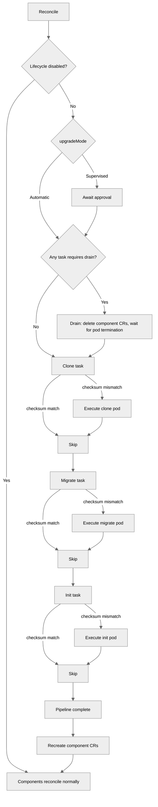

<!--
Licensed to the Apache Software Foundation (ASF) under one
or more contributor license agreements.  See the NOTICE file
distributed with this work for additional information
regarding copyright ownership.  The ASF licenses this file
to you under the Apache License, Version 2.0 (the
"License"); you may not use this file except in compliance
with the License.  You may obtain a copy of the License at

  http://www.apache.org/licenses/LICENSE-2.0

Unless required by applicable law or agreed to in writing,
software distributed under the License is distributed on an
"AS IS" BASIS, WITHOUT WARRANTIES OR CONDITIONS OF ANY
KIND, either express or implied.  See the License for the
specific language governing permissions and limitations
under the License.
-->

# Lifecycle

The operator manages database migrations and application initialization through
dedicated lifecycle tasks. This page covers configuration, behavior, and
troubleshooting.

## Overview

The `spec.lifecycle` section controls up to three sequential tasks:

1. **clone** — database snapshot from an external source (staging workflows)
2. **migrate** — `superset db upgrade` (database schema migration)
3. **init** — `superset init` (application initialization: roles, permissions)

Tasks run as bare Pods (`restartPolicy: Never`) managed by dedicated
`SupersetLifecycleTask` child CRs. The parent Superset controller orchestrates
sequencing, gating, and re-runs; the task controller manages pod lifecycle,
retries, and timeouts.

Lifecycle is enabled by default even when `spec.lifecycle` is nil; disable it
explicitly with `spec.lifecycle.disabled: true`.

**Key behaviors:**

- Clone must complete before migrate starts; migrate must complete before init starts
- Components are not created or updated until all enabled tasks complete
- When config or image changes require a re-run, the parent deletes the old task CR and creates a fresh one

## Task Triggers

Each task has hardcoded trigger inputs — what it watches for changes:

| Task | Watches | Re-runs when... |
|------|---------|-----------------|
| Clone | `trigger` field, `cronSchedule` tick, source config, excludes | Trigger value changes, schedule tick boundary crossed, or source DB config changes |
| Migrate | Image (resolved lifecycle image) | Image tag or repository changes |
| Init | Config checksum (rendered Python config) | Any config-affecting field changes |

All tasks also re-run when an upstream task re-executes (automatic propagation).

### Manual Trigger

Every task has a `trigger` field (on `BaseTaskSpec`) — an opaque string that
forces a re-run when changed. Changing a trigger also cascades to all downstream
tasks:

```yaml
spec:
  lifecycle:
    migrate:
      trigger: "force-2026-05-10"  # forces migrate + init to re-run
    init:
      trigger: "reset-roles"       # forces only init to re-run
```

### Disabling Tasks

Set `disabled: true` to skip a task entirely:

```yaml
spec:
  lifecycle:
    migrate:
      disabled: true  # user manages migrations externally
```

### Scheduled Execution

Tasks that support scheduling (currently clone) accept a `cronSchedule` field —
a standard 5-field cron expression that triggers periodic re-execution:

```yaml
spec:
  environment: Staging
  lifecycle:
    clone:
      cronSchedule: "0 2 * * *"  # daily at 2 AM UTC
      source:
        host: postgres-prod.db.svc
        database: superset_prod
        username: prod_reader
        passwordFrom:
          name: prod-reader-creds
          key: password
```

When a schedule is configured, the operator automatically re-runs the full
lifecycle pipeline (clone → migrate → init) each time a cron tick boundary is
crossed. The `trigger` field remains functional for manual overrides on top of
the schedule — both contribute independently.

**How it works:**

- The operator computes the "current tick" (most recent past time matching the
  expression) and includes it in the task checksum
- When the clock crosses a cron boundary, the tick changes, the checksum changes,
  and the pipeline re-runs
- The operator requeues itself to wake at the next cron tick
- If the operator is down during a scheduled tick, it catches up on the next
  reconcile
- If the pipeline is still running when a tick fires, it completes normally; the
  new tick is detected afterward and triggers one re-run (no backlog accumulation)

**Status reporting:**

The clone task status includes `lastScheduledAt` (the tick that triggered the
most recent run) and `nextScheduleAt` (the next future tick).

**Alternative — external CronJob:**

For teams that prefer external scheduling, a Kubernetes CronJob can patch
the `trigger` field on a cron schedule. This requires a CronJob resource,
ServiceAccount, RoleBinding, and a kubectl image, but keeps the scheduling
logic outside the operator.

When disabled, the task's CR is deleted and it does not participate in the
pipeline. Downstream tasks still run but don't receive propagation from the
disabled task.

## Upgrade Mode

The `upgradeMode` field controls how image upgrades are handled:

- **Automatic** (default) — tasks run immediately when an image change is detected
- **Supervised** — tasks wait for an annotation-based approval before running

```yaml
spec:
  lifecycle:
    upgradeMode: Supervised
```

When an image change is detected in supervised mode, the operator sets
`status.phase: AwaitingApproval` and records the upgrade context in
`status.lifecycle.upgrade`. Approve the upgrade by annotating the CR:

```bash
kubectl annotate superset my-superset superset.apache.org/approve-upgrade=true
```

The operator clears the annotation automatically after lifecycle tasks complete.
You can monitor the upgrade status with:

```bash
kubectl get superset my-superset -o jsonpath='{.status.lifecycle}'
```

The operator also performs semver comparison on image tags and blocks downgrades
to prevent accidental database corruption. A blocked downgrade sets
`status.phase: Blocked` — revert the image tag to resolve.

## Drain Behavior

Each task declares whether it requires components to be drained (scaled to zero)
before execution. The operator drains once before the first task that requires it,
and recreates components after the pipeline completes.

| Task | Default `requiresDrain` | Rationale |
|------|------------------------|-----------|
| Clone | `true` | DROP DATABASE fails with active connections |
| Migrate | `true` | Schema changes risk deadlocks and version/schema inconsistencies |
| Init | `false` | Role/permission operations are safe with components running |

Override per-task when needed:

```yaml
spec:
  lifecycle:
    migrate:
      requiresDrain: false  # opt-in to rolling migrations (additive changes only)
    init:
      requiresDrain: true   # force drain before init (rare)
```

During a drain, Ingress/HTTPRoute and NetworkPolicy resources are preserved (they
are owned by the parent CR, not child CRs). Once all lifecycle tasks complete,
components are recreated and traffic resumes automatically.

## Lifecycle Flow

The following diagram shows the lifecycle pipeline. Tasks execute sequentially;
components are drained before the first task that requires it, and recreated
after the pipeline completes.



Disabled tasks are removed from the pipeline entirely (not shown as "skip").

## Custom Commands

```yaml
spec:
  lifecycle:
    migrate:
      command: ["/bin/sh", "-c", "superset db upgrade && custom-migrate"]
    init:
      command: ["/bin/sh", "-c", "superset init && custom-seed"]
```

Both `adminUser` and `loadExamples` (see below) are mutually exclusive with a
custom `lifecycle.init.command` — when using these fields, the operator
constructs the full init command automatically.

## Timeout, Retries, and Pod Retention

Each task has configurable timeout and retry behavior:

```yaml
spec:
  lifecycle:
    podRetention:
      policy: RetainOnFailure    # Delete (default) | Retain | RetainOnFailure
    migrate:
      timeout: 10m               # max time per attempt (default: 5m)
      maxRetries: 5              # attempts before permanent failure (default: 3)
    init:
      timeout: 5m
      maxRetries: 3
```

On failure, the operator retries with exponential backoff (`10s * 2^(attempt-1)`,
capped at 5m). If a pod exceeds the timeout while Running or Pending, it counts
as a failed attempt.

**Pod retention policies:**

| Policy | On Success | On Failure |
|---|---|---|
| `Delete` (default) | Pod deleted | Pod deleted |
| `Retain` | Pod kept | Pod kept |
| `RetainOnFailure` | Pod deleted | Pod kept for debugging |

Use `RetainOnFailure` to inspect logs of failed migrations:

```bash
kubectl logs <pod-name> -c superset
```

## Admin User (Development Mode Only)

In Development mode, the operator can create an admin user during initialization:

```yaml
spec:
  environment: Development
  lifecycle:
    init:
      adminUser:
        username: admin           # default
        password: admin           # default
        firstName: Superset       # default
        lastName: Admin           # default
        email: admin@example.com  # default
```

All fields have defaults, so `adminUser: {}` creates a user with
username/password `admin`/`admin`. The operator passes credentials as env vars
and appends a `superset fab create-admin` step to the init command. This field
is rejected in Production and Staging modes by CRD validation.

## Load Examples (Development Mode Only)

Load Superset's example dashboards and datasets during initialization:

```yaml
spec:
  environment: Development
  lifecycle:
    init:
      loadExamples: true
```

The operator appends a `superset load-examples` step to the init command. This
field is rejected in Production and Staging modes by CRD validation. Note that Superset's built-in
examples require an admin user with username `admin` — if you customize
`adminUser.username`, example loading may fail.

## Lifecycle Pod Template

The `spec.lifecycle` section supports `podTemplate` with the same Pod and
container fields as other components (tolerations, nodeSelector, volumes, etc.
on `podTemplate`; env, resources, securityContext, etc. on
`podTemplate.container`), so task pods inherit top-level scheduling and security
settings and can be customized independently:

```yaml
spec:
  lifecycle:
    podTemplate:
      container:
        resources:
          limits:
            memory: "2Gi"
    migrate:
      command: ["/bin/sh", "-c", "superset db upgrade"]
```

## Clone (Development and Staging Mode Only)

The clone task creates a database snapshot from an external source into the CR's
metastore before running migrations. This enables staging workflows where you
test version upgrades against a copy of production data.

Clone is only allowed when `environment: Development` or `environment: Staging`
— it performs a destructive DROP DATABASE on the target metastore and must never
run against a production instance. Staging mode enforces secrets (like
Production) while still permitting clone operations.

### Staging Workflow

The recommended pattern is a separate `Superset` CR for staging:

```yaml
apiVersion: superset.apache.org/v1alpha1
kind: Superset
metadata:
  name: superset-staging
spec:
  environment: Staging
  image:
    tag: "6.0.0"                     # version to test
  secretKeyFrom:
    name: staging-secret
    key: secret-key
  metastore:
    type: PostgreSQL
    host: postgres-staging.db.svc
    database: superset_staging
    username: superset_admin         # needs CREATEDB rights
    passwordFrom:
      name: staging-db-creds
      key: password
  lifecycle:
    clone:
      trigger: "2026-05-09-v1"       # change to re-clone
      source:
        host: postgres-prod.db.svc
        database: superset_prod
        username: prod_reader        # read-only on production
        passwordFrom:
          name: prod-reader-creds
          key: password
      excludeTables:
        - tab_state
      excludeTableData:
        - logs
        - query
      timeout: 30m
    migrate:
      strategy: Always
    init:
      strategy: Always
  webServer: {}
  celeryWorker: {}
  # celeryBeat intentionally omitted — prevents alert double-triggers
```

The lifecycle pipeline runs: **clone → migrate → init → components**. Components
are not deployed until all tasks complete, and clone always drains existing
components before running (DROP DATABASE fails with active connections).

### Clone Strategy

| Strategy | Behavior |
|---|---|
| `OnTrigger` (default) | Runs when the `trigger` value changes |
| `Always` | Runs on every spec change |
| `Never` | Disabled |

The `trigger` field is opaque — use a date, UUID, or CI build ID. The operator
includes it in the task checksum; changing it causes a re-clone.

### Table Exclusion

- `excludeTables` — tables excluded entirely (schema and data). Use for tables
  that are not needed and can be recreated by migrations (e.g., `tab_state`).
- `excludeTableData` — schema is dumped but data is not. Use for large tables
  where migrations expect the schema to exist but the data is not needed for
  testing (e.g., `logs`, `query`).

### Custom Clone Command

By default the operator constructs a streaming `pg_dump | psql` (or
`mysqldump | mysql`) command. Override it for custom workflows (anonymization,
database-native snapshots, etc.):

```yaml
spec:
  lifecycle:
    clone:
      command: ["/bin/sh", "-c", "custom-clone-script.sh"]
      image:
        repository: my-registry/custom-tools
        tag: "v1"
      source:
        host: postgres-prod.db.svc
        database: superset_prod
        username: prod_reader
        passwordFrom:
          name: prod-reader-creds
          key: password
```

When a custom command is set, the operator still injects all env vars
(`SUPERSET_OPERATOR__CLONE_SRC_*` and `SUPERSET_OPERATOR__DB_*`) so your script
can use them.

### Clone Image

The clone pod uses a database-tool image (not the Superset image):

| Source type | Default image |
|---|---|
| `postgresql` | `postgres:17-alpine` |
| `mysql` | `mysql:8-alpine` |

Override with `clone.image` if you need additional tools.

### Requirements

- **Metastore must use structured mode** (host, database, username) — passthrough
  URI mode is not supported for clone.
- **Metastore user must have CREATEDB rights** — the clone drops and recreates
  the target database.
- **Source user should be read-only** — the clone only reads from production.
- **Network access** — the clone pod needs egress to both source and target
  databases. Configure NetworkPolicy accordingly.

## How It Works Under the Hood

### Pipeline Checksum Model

The lifecycle uses a **checksum chain** to determine which tasks execute and
which skip. Each task receives an incoming checksum from the previous stage,
adds its own unique inputs, and produces a task checksum. On completion, that
checksum is stored in the task CR's status and becomes the incoming checksum for
the next task.

```
                     parentUID (stable anchor)
                         ↓
clone.checksum   = hash(parentUID, "Clone", command, trigger, source, excludes)
                         ↓ (stored in clone CR status on completion)
migrate.checksum = hash(clone.status.checksum, "Migrate", command, trigger, image)
                         ↓ (stored in migrate CR status on completion)
init.checksum    = hash(migrate.status.checksum, "Init", command, trigger, configChecksum)
```

**The universal rule:** a task executes when its computed checksum differs from
the checksum stored on its completed task CR. If they match, the task skips.

**Upstream propagation is automatic:** when clone re-runs (e.g., trigger
changed), its status checksum changes. That new value flows into migrate's
checksum computation, making it differ from its stored value — so migrate
re-runs too. The chain continues transitively to init.

**Isolation by design:** each task watches only its own relevant inputs.
Image changes affect only migrate (and downstream via propagation). Config
changes affect only init. Clone source changes affect only clone (and
downstream via propagation).

### Why Bare Pods

- **Controlled retries** — The operator decides when and how to retry, with
  configurable max attempts and exponential backoff
- **Clean audit trail** — Each attempt creates a new Pod with a unique
  `generateName` suffix, making it easy to inspect history
- **Sidecar handling** — The operator manages pod lifecycle directly, avoiding
  the Job controller's sidecar termination issues

### Pod State Machine

Task pods transition through these states:

- **Pending** — No pod exists yet. The operator creates one.
- **Running** — Pod is executing. If it exceeds the timeout, it counts as a failed attempt.
- **Succeeded** → **Complete** — Task is done; the next task (or components) can proceed.
- **Failed** — If `attempts < maxRetries`, the operator deletes the pod and requeues with exponential backoff. If `attempts >= maxRetries`, the task is permanently failed.

### Pod Naming and Discovery

Pods use `generateName` (`{parent}-{task}-{random}`, e.g. `my-superset-migrate-x7k2m`)
for unique names per attempt. The operator discovers pods by label
(`superset.apache.org/instance` and `superset.apache.org/task`) and uses
the most recently created one when multiple exist.

### Task Pod Spec

Task pods inherit scheduling, security, volumes, and env from the top-level
`podTemplate`, just like other components. Key fields:

- **Image**: From `spec.image`
- **Command**: From `spec.lifecycle.migrate.command` or `spec.lifecycle.init.command` (defaults: `superset db upgrade` and `superset init`)
- **Config**: Mounted from the task ConfigMap (`{parent}-{task}-config`)
- **Env vars**: Database credentials, secret key (via plain env vars in dev mode, or `valueFrom.secretKeyRef` when `*From` fields are used)
- **Resources**: From `spec.lifecycle.podTemplate.container.resources` if set
- **Service account**: Inherited from parent spec
- **Restart policy**: Always `Never` — the operator handles retries

## Status Reporting

Lifecycle task progress is tracked per-task in the parent status:

```yaml
status:
  lifecycle:
    phase: Complete        # Idle | Cloning | Draining | Migrating | Initializing | Complete | Blocked | AwaitingApproval
    clone:
      state: Complete      # Pending | Running | Complete | Failed (only present when clone is enabled)
      podName: superset-staging-clone-k8x2m
      duration: "4m32s"
      attempts: 1
    migrate:
      state: Complete      # Pending | Running | Complete | Failed
      podName: my-superset-migrate-x7k2m
      startedAt: "2026-03-16T10:00:00Z"
      completedAt: "2026-03-16T10:00:12Z"
      duration: "12s"
      attempts: 1
      image: apache/superset:latest
    init:
      state: Complete
      podName: my-superset-init-a9b3k
      startedAt: "2026-03-16T10:00:13Z"
      completedAt: "2026-03-16T10:00:22Z"
      duration: "9s"
      attempts: 1
      image: apache/superset:latest
```

**Parent phase values related to lifecycle:**

| Phase | Meaning |
|---|---|
| `Initializing` | First deployment — lifecycle tasks running for the first time |
| `Upgrading` | Image change detected — lifecycle tasks running against new version |
| `Draining` | Drain strategy active — components being removed before running tasks |
| `Blocked` | Downgrade detected — lifecycle tasks will not run (manual intervention required) |
| `AwaitingApproval` | Supervised upgrade mode — waiting for approval annotation before proceeding |
